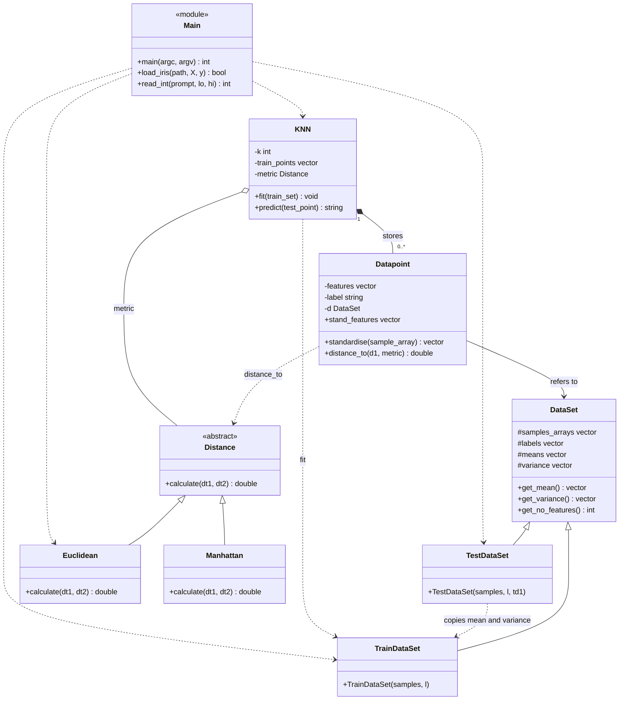

# MiniKNN: a K-Nearest-Neighbours classifier in C++

MiniKNN classifies Iris flowers by looking at the flowers that are most similar to them. It is built with object-oriented C++ (inheritance, polymorphism, abstraction, encapsulation and composition) and tested on the 150-row Iris dataset.

**Course project:** DSAI, IIIT Bangalore (2nd year) | **Team:** Srujan, Nikunj, Nikith, Susheel

## Table of contents
1. [How KNN works](#how-knn-works)
2. [Team and responsibilities](#team-and-responsibilities)
3. [Project structure](#project-structure)
4. [Build and run](#build-and-run)
5. [Dataset format](#dataset-format)
6. [Class overview](#class-overview)
7. [UML diagram](#uml-diagram)
8. [Design decisions](#design-decisions)
9. [Sample output](#sample-output)
10. [Known issues and fixes](#known-issues-and-fixes)
11. [Possible extensions](#possible-extensions)
12. [Viva questions](#viva-questions)

## How KNN works
To classify a new flower:
1. Measure its **distance** to every flower in the training set.
2. Pick the **K closest** ones.
3. Let those K neighbours **vote**. The most common species wins.

There is no real "training" step. KNN just remembers the training data, which is why it is called a *lazy learner*.

Before measuring distances, every feature is **standardised** (mean 0, variance 1), so a feature with large numbers cannot dominate the distance. The test data is standardised using the **training** mean and variance, which stops information leaking from the test set.

**Pipeline in `main`:** load CSV, shuffle with a fixed seed (42), split 80% train / 20% test, build `TrainDataSet` and `TestDataSet`, ask for K, fit `KNN`, predict each test flower, print accuracy and a confusion matrix.

## Team and responsibilities

| Member | Part | Files |
|---|---|---|
| **Susheel** | Datasets and data points | `dataset.h`, `datapoint.h` |
| **Srujan** | Distance metrics, UML diagrams, documentation | `distance.h`, `diagrams/`, `UML.md`, this README |
| **Nikith** | KNN classifier | `knn.h`, `knn.cpp` |
| **Nikunj** | `main` function | `main.cpp` |

## Project structure
```
MiniKNN/
├── main.cpp        # loads data, splits, runs KNN, prints results   (Nikunj)
├── knn.h           # KNN class declaration                          (Nikith)
├── knn.cpp         # fit() and predict()                            (Nikith)
├── distance.h      # Distance, Euclidean, Manhattan                 (Srujan)
├── datapoint.h     # Datapoint: one row + standardised features     (Susheel)
├── dataset.h       # DataSet, TrainDataSet, TestDataSet             (Susheel)
├── Iris.csv        # the dataset (150 rows)
├── UML.md          # all class diagrams
├── diagrams/       # Mermaid source for every diagram
└── README.md
```

## Build and run
Requires a C++17 compiler (`main.cpp` uses structured bindings).

```bash
g++ -std=c++17 -Wall -Wextra main.cpp knn.cpp -o miniknn
./miniknn Iris.csv      # or just ./miniknn if Iris.csv is in the same folder
```

The program prints the dataset sizes, then asks for **K** (1 to the training size, 120). Invalid input is rejected and asked again.

## Dataset format
`load_iris` expects the common Kaggle layout. The first line is a header and is skipped.

```
Id,SepalLengthCm,SepalWidthCm,PetalLengthCm,PetalWidthCm,Species
1,5.1,3.5,1.4,0.2,Iris-setosa
```

Each row is read as: skip `Id`, read 4 numeric features, read the species label. Windows line endings (`\r`) are handled. The loader returns `false` if the file cannot be opened.

## Class overview

| Class | Kind | Responsibility |
|---|---|---|
| `DataSet` | base class | Stores samples and labels, transposes them into per-feature columns, computes mean and variance per feature. Getters only, so the data is encapsulated. |
| `TrainDataSet` | derives `DataSet` | Computes mean and variance from its own data. |
| `TestDataSet` | derives `DataSet` | Copies mean and variance from a `TrainDataSet`, so test data is scaled like the training data. |
| `Datapoint` | class | One flower: raw `features`, `label`, and `stand_features` (standardised using its `DataSet`). `distance_to(other, metric)` delegates to a `Distance`. |
| `Distance` | abstract class | Interface with one pure virtual function `calculate(a, b)`. |
| `Euclidean` | derives `Distance` | Square root of the sum of squared differences. |
| `Manhattan` | derives `Distance` | Sum of absolute differences. |
| `KNN` | class | `fit` copies the training points in, `predict` finds the K nearest and votes. Holds a `const Distance*`, so the metric can be swapped without touching `KNN`. |
| `main.cpp` | program | `load_iris`, `read_int` and `main`: the CLI and the experiment. |

## UML diagram
The whole project is shown below. The individual diagrams (data layer, distance, KNN, main) are in [`UML.md`](UML.md), and their Mermaid sources are in `diagrams/`.



**Reading the arrows:** `<|--` is inheritance. `*--` is composition (`KNN` owns its stored training points). `o--` is aggregation (`KNN` points to a `Distance` but does not own it). `-->` is an association (a `Datapoint` refers to its `DataSet`). `..>` is a dependency (uses temporarily).

## Design decisions
- **Abstract `Distance` class (Strategy pattern).** `KNN` only knows `Distance`. Switching from Euclidean to Manhattan is a one-line change in `main`, and a new metric needs no edits in `KNN`. This is the open/closed principle.
- **Polymorphism through a pointer.** `KNN` stores `const Distance*`, so the correct `calculate` is chosen at run time.
- **Inheritance for datasets.** `TrainDataSet` and `TestDataSet` share almost everything and differ in one thing: where mean and variance come from.
- **Standardisation with training statistics only.** Prevents data leakage and keeps all features on the same scale.
- **Encapsulation.** `Datapoint` keeps `features` and `label` private, and `DataSet` keeps its arrays protected with const getters.
- **Majority voting with a `map<string,int>`.** Simple and readable. On a tie, the label that comes first alphabetically wins, because the map is ordered and only a strictly higher count replaces the current winner.

## Sample output
Run on the 150-row Iris dataset, seed 42, 120 train / 30 test, Euclidean distance:

```
Loaded 150 samples.
Train: 120  Test: 30

Enter K (1-120): 9

K = 9
Accuracy: 28/30 = 93.3333%

Confusion matrix (rows = actual, cols = predicted):
  Iris-setosa: Iris-setosa=7
  Iris-versicolor: Iris-versicolor=14
  Iris-virginica: Iris-versicolor=2  Iris-virginica=7
```

Other values on the same split: K=1 gives 90%, K=5 gives 86.7%. With only 30 test flowers, one mistake moves the accuracy by 3.3 points, so small differences between K values are mostly noise. Setosa was classified perfectly in every run, because it is well separated from the other two species. All errors were between versicolor and virginica, which overlap.

The confusion matrix only prints non-zero cells.

## Known issues and fixes
Please fix these before submitting.

1. **`knn.cpp` includes `"KNN.h"` but the file is `knn.h`.** This compiles on Windows but fails on Linux and macOS (case-sensitive file systems). Change it to `#include "knn.h"`.
2. **`distance.h`: use `fabs`, not `abs`.** `abs` on a `double` can call the integer version and drop the decimals, so Manhattan distances come out wrong. Use `std::fabs`. (The current main uses Euclidean, so results above are not affected, but Manhattan would be.) Also add `virtual ~Distance() {}` to the base class.
3. **Zero variance.** `standardise` divides by `sqrt(variance)`. A feature that is constant in the training data would divide by zero. Not an issue for Iris, but worth a guard.
4. **Lifetime.** A `Datapoint` holds a *reference* to its `DataSet`, so the dataset must outlive its points. In `main` this is true because the datasets are created first and live until the end.

## Possible extensions
- Select the metric at run time (Euclidean or Manhattan) through a menu in `main`.
- Compare accuracies for K = 1..20 in a loop and print the best K.
- k-fold cross-validation for a more reliable accuracy than one 30-flower test set.
- Weighted voting, where closer neighbours count more.
- Use `std::partial_sort` in `predict`, since only the K smallest distances are needed.


