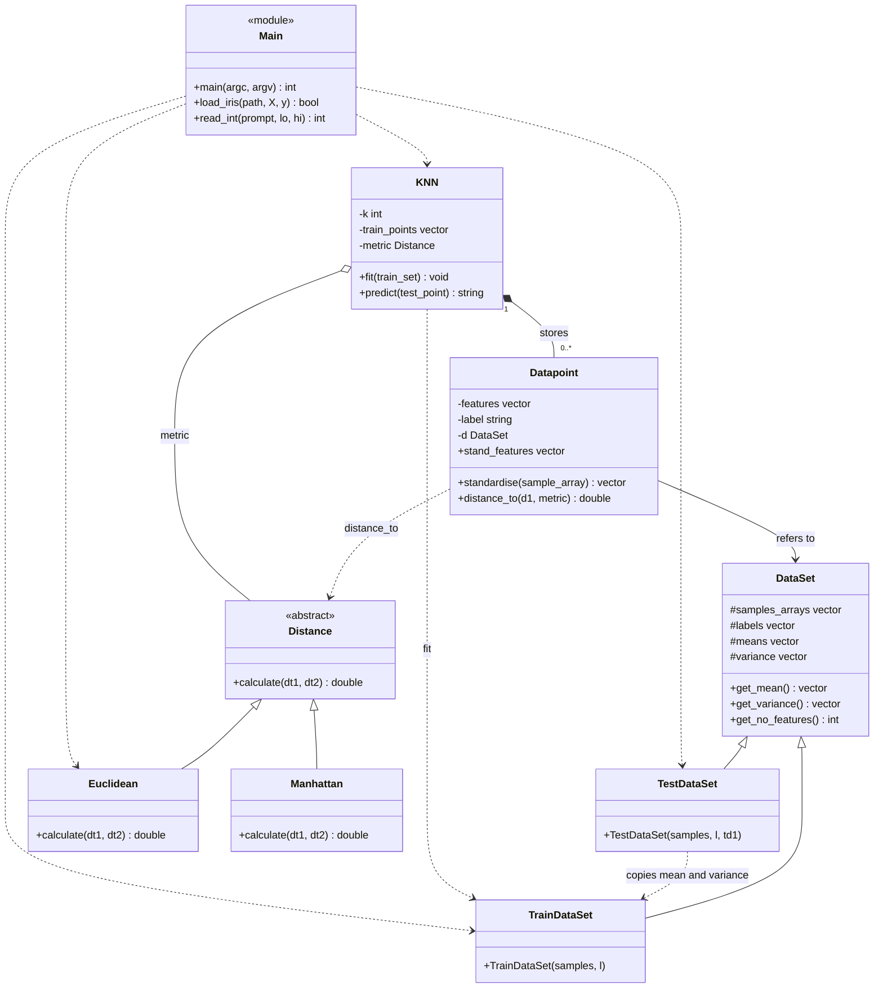

# MiniKNN: K-Nearest-Neighbours Classifier in C++

MiniKNN is a small machine learning library written in C++. It uses the **K-Nearest-Neighbours (KNN)** algorithm to predict the species of an Iris flower from four measurements. The project is built with object-oriented programming: classes, inheritance, abstract classes and polymorphism.

## What is KNN?
KNN classifies a new data point by looking at the points that are most similar to it.

1. Measure the **distance** from the new flower to every flower in the training data.
2. Pick the **K closest** flowers (the neighbours).
3. Let the neighbours **vote**. The species that appears most often is the prediction.

**Example:** with K = 5, if the 5 nearest flowers are 4 versicolor and 1 virginica, the prediction is *versicolor*.

KNN has no real training step. It just stores the training data and does the work when predicting, which is why it is called a *lazy learner*.

## Dataset
We use the **Iris dataset**: 150 flowers, 3 species (50 each).

| Feature | Meaning |
|---|---|
| SepalLengthCm | Length of the sepal |
| SepalWidthCm | Width of the sepal |
| PetalLengthCm | Length of the petal |
| PetalWidthCm | Width of the petal |
| Species | Iris-setosa, Iris-versicolor or Iris-virginica (the label we predict) |

The CSV file looks like this. The first line is a header and is skipped, and the `Id` column is ignored:

```
Id,SepalLengthCm,SepalWidthCm,PetalLengthCm,PetalWidthCm,Species
1,5.1,3.5,1.4,0.2,Iris-setosa
2,4.9,3.0,1.4,0.2,Iris-setosa
```

## How the program runs
1. **Load** `Iris.csv`.
2. **Shuffle** the rows with a fixed seed (42), so results are the same every run.
3. **Split** into 80% training (120 flowers) and 20% test (30 flowers).
4. **Standardise** the features (explained below).
5. Ask the user for **K**.
6. **Predict** the species of every test flower.
7. Print the **accuracy** and a **confusion matrix**.

### Why standardise?
Features can have different ranges, and a feature with big numbers would dominate the distance. Standardising rescales every feature to mean 0 and variance 1:

```
standardised value = (value - mean) / sqrt(variance)
```

The mean and variance always come from the **training** data, even when scaling the test data. This keeps the test set "unseen", like real new data.

## Project structure
```
MiniKNN/
├── main.cpp       # loads data, splits it, runs KNN, prints results
├── knn.h          # KNN class declaration
├── knn.cpp        # KNN fit() and predict()
├── distance.h     # Distance (abstract), Euclidean, Manhattan
├── datapoint.h    # Datapoint class (one flower)
├── dataset.h      # DataSet, TrainDataSet, TestDataSet
├── Iris.csv       # the dataset
├── UML.md         # all UML class diagrams
├── diagrams/      # Mermaid source files for the diagrams
└── README.md
```

## The classes

### Data layer (`dataset.h`, `datapoint.h`)
- **`DataSet`** is the base class. It stores the samples and labels, rearranges them into one list per feature, and calculates the mean and variance of each feature. Its data is hidden and accessed only through getters.
- **`TrainDataSet`** inherits from `DataSet` and calculates mean and variance from its own data.
- **`TestDataSet`** inherits from `DataSet` and **copies** the mean and variance from a `TrainDataSet`.
- **`Datapoint`** represents one flower. It keeps the raw `features`, the `label`, and the standardised features (`stand_features`). Its `distance_to(other, metric)` function asks a `Distance` object to do the calculation.

### Distance (`distance.h`)
- **`Distance`** is an **abstract class** with one pure virtual function, `calculate(a, b)`.
- **`Euclidean`** returns the straight-line distance: the square root of the sum of squared differences.
- **`Manhattan`** returns the "city block" distance: the sum of absolute differences.

New metrics can be added by writing one more class that inherits from `Distance`. Nothing else needs to change.

### Classifier (`knn.h`, `knn.cpp`)
- **`KNN(k, metric)`** stores K and a pointer to a `Distance`.
- **`fit(train_set)`** copies the training flowers into the classifier.
- **`predict(test_point)`** works out the distance to every training flower, sorts them, takes the first K, counts the votes per species and returns the winner.

### Main (`main.cpp`)
- **`load_iris`** reads the CSV file into feature and label lists.
- **`read_int`** asks for a number and keeps asking until the input is valid.
- **`main`** runs the full pipeline from the section above.

## OOP concepts used
| Concept | Where |
|---|---|
| **Inheritance** | `TrainDataSet` and `TestDataSet` from `DataSet`; `Euclidean` and `Manhattan` from `Distance` |
| **Abstraction** | `Distance` defines what a distance must do, not how |
| **Polymorphism** | `KNN` calls `metric->calculate(...)` and the right version runs for Euclidean or Manhattan |
| **Encapsulation** | Private and protected data with public getters |
| **Composition** | `KNN` stores its own list of training `Datapoint`s |

## UML class diagram
The diagram below shows the whole project. The separate diagrams for the data layer, distance, KNN and main are in [UML.md](UML.md).



How to read it: `<|--` means inheritance, `*--` means "owns", `o--` means "uses but does not own", `-->` means "refers to", and `..>` means "depends on".

## Build and run
You need a C++ compiler that supports C++17, for example g++.

```bash
g++ -std=c++17 main.cpp knn.cpp -o miniknn
./miniknn Iris.csv
```

On Windows, run `miniknn.exe Iris.csv` instead. If you don't pass a file name, the program looks for `Iris.csv` in the current folder. Then type a value for K between 1 and 120 when asked.

## Example output
```
Loaded 150 samples.
Train: 120  Test: 30

Enter K (1-120): 9

K = 9
Accuracy: 28/30 = 93.3333%

Confusion matrix (rows = actual, cols = predicted):
  Iris-setosa: Iris-setosa=7
  Iris-versicolor: Iris-versicolor=14
  Iris-virginica: Iris-versicolor=2  Iris-virginica=7
```

**Reading the confusion matrix:** each row is the *actual* species and each entry shows what the model predicted. Here, all 7 setosa and all 14 versicolor were correct, and 7 of the 9 virginica were correct, with 2 mistaken for versicolor. Only non-zero cells are printed.

## Results
Same split (seed 42), Euclidean distance:

| K | Accuracy |
|---|---|
| 1 | 90.0% |
| 5 | 86.7% |
| 9 | 93.3% |

Setosa is easy to separate from the other two species. Almost all mistakes are between versicolor and virginica, whose measurements overlap. The test set has only 30 flowers, so one mistake changes the accuracy by about 3.3 points.

## Limitations
- The result depends on one train/test split. A cross-validation would be more reliable.
- If two species tie in the vote, the one that comes first alphabetically wins.
- The metric (Euclidean or Manhattan) is chosen in the code, not by the user at run time.
- `predict` checks every training flower, so it gets slower as the dataset grows.


## Team
IIIT Bangalore, DSAI 2nd year.

| Name | Responsibility |
|---|---|
| Susheel | Datasets and data points (`dataset.h`, `datapoint.h`) |
| Srujan | Distance metrics, UML diagrams, documentation (`distance.h`, `UML.md`, `README.md`) |
| Nikith | KNN classifier (`knn.h`, `knn.cpp`) |
| Nikunj | Main function (`main.cpp`) |


